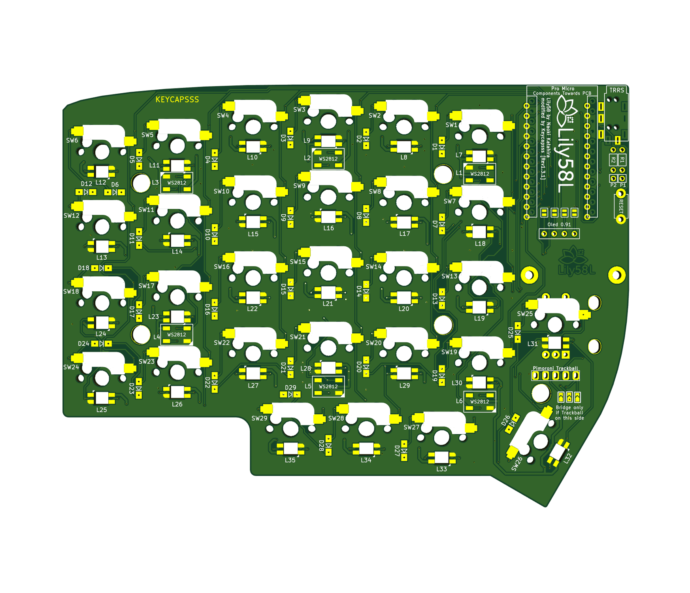
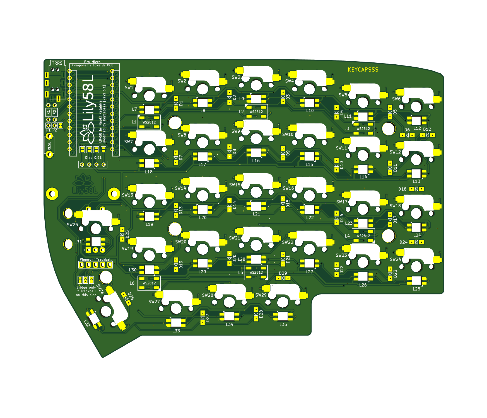
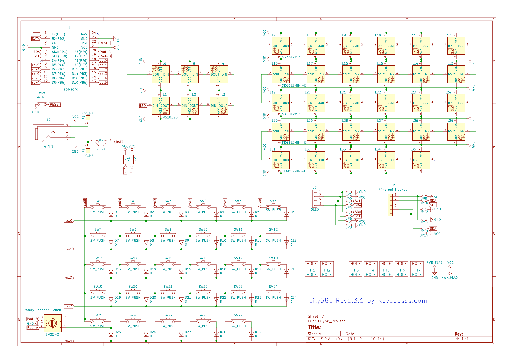

# Lily58L

Lily58L is 6×4+4keys column-staggered split keyboard.

It is a modified version of the Lily58 Pro pcb from [kata0510](https://github.com/kata0510)
and has the the following additional features.

- One rotary encoder support on each side (optional)
- Optional Pimoroni Trackball (on master side)
- Underglow with WS2812 (5050) RGB LED's (6 per side)
- Per switch RGB LED with SK6812 Mini-E led (with legs, easy to solder)

## [Build-Guide](buildguide_en.md)

**Hardware available at [keycapsss.com](https://keycapsss.com/keyboard-parts/pcbs/71/lily58l-split-keyboard-pcb)**

## Changelog

### Rev1.3

- Change underglow footprint to WS2812 (5050) (easier to solder)
- Add footprint for optional [Pimoroni Trackball Module](https://keycapsss.com/keyboard-parts/parts/157/pimoroni-trackball-breakout-i2c) (most inner position)
- Improve silkscreen

### REV1

- Add per switch RGB LED's (SK6812 Mini-E)
- Add underglow RGB LED's (SK6812 Mini)
- Add footprint for an optional rotary encoder

## Parts

| Part name                                                                                                                                                                                                                                 | Quantity                  | Remarks                                                                                                                                                                            | Photo |
| ----------------------------------------------------------------------------------------------------------------------------------------------------------------------------------------------------------------------------------------- | ------------------------- | ---------------------------------------------------------------------------------------------------------------------------------------------------------------------------------- | ----- |
| Lily58L PCB                                                                                                                                                                                                                               | 2 pcs                     |                                                                                                                                                                                    |
| Lily58L case                                                                                                                                                                                                                              | 1 set                     | 2 solid panels, 2 with holes for switches                                                                                                                                          |
| [Pro Micro](https://keycapsss.com/keyboard-parts/parts/79/arduino-pro-micro-atmega32u4-controller), [Puchi-C](https://keycapsss.com/keyboard-parts/mcu-controller/141/puchi-c-pro-micro-replacement-with-usb-c-and-atmega32u4) or Elite-C | 2 pcs (a mix is possible) | Optionally, use [Mill-Max Single Row Socket Headers](https://keycapsss.com/keyboard-parts/parts/100/single-row-socket-headers-pins-mill-max-series-315), to make it hot-swappable. |       |
| Key switch (MX)                                                                                                                                                                                                                           | 58 pcs                    |                                                                                                                                                                                    |       |
| [Kailh switch socket](https://keycapsss.com/keyboard-parts/parts/49/kailh-hot-swap-pcb-sockets-10-pcs)                                                                                                                                    | 58 pcs                    |                                                                                                                                                                                    |       |
| Diodes 1N4148W (SMD)                                                                                                                                                                                                                      | 58 pcs                    |                                                                                                                                                                                    |       |
| TRRS jack                                                                                                                                                                                                                                 | 2 pcs                     |                                                                                                                                                                                    |
| Tactile switch                                                                                                                                                                                                                            | 2 pcs                     | Reset switch                                                                                                                                                                       |       |
| TRRS cable                                                                                                                                                                                                                                | 1 cable                   | Must be a 4-pole cable                                                                                                                                                             |       |
| Key caps                                                                                                                                                                                                                                  | 58 pcs                    | 1.5U caps, can also be 1U                                                                                                                                                          |       |
| Micro USB or USB-C cable                                                                                                                                                                                                                  | 1 pcs                     | Dependent what you use on the master half.                                                                                                                                         |       |

### Optionally

| Part name                                                                                                        | Quantity | Remarks                                                                                                     | Photo |
| ---------------------------------------------------------------------------------------------------------------- | -------- | ----------------------------------------------------------------------------------------------------------- | ----- |
| [OLED module](https://keycapsss.com/keyboard-parts/parts/80/ssd1306-oled-lcd-display-0.91-inch-128x32-i2c-white) | 2 pcs    | It is possible to use only one display                                                                      |       |
| WS2812 (5050)                                                                                                    | 12 pcs   | RGB LED's for underglow                                                                                     |       |
| SK6812 Mini-E                                                                                                    | 58 pcs   | RGB LED's for keycap backlight **(underglow LED's must be soldered, because they are connected in series)** |       |

## Firmware

Clone/download the QMK firmware and execute the following in the [qmk_firmware](https://github.com/qmk/qmk_firmware) directory to write the default Lily58L keymap

    make lily58/light:lily58l:avrdude

When **`Detecting USB port, reset your controller now...`** is displayed, press the reset button on the keyboard to start writing.
Each half of the keyboard must be programmed separately using this approach.

If you're using DFU bootloader (in case of the elite c), replace the 'avrdude' with 'dfu'

## Schematic

