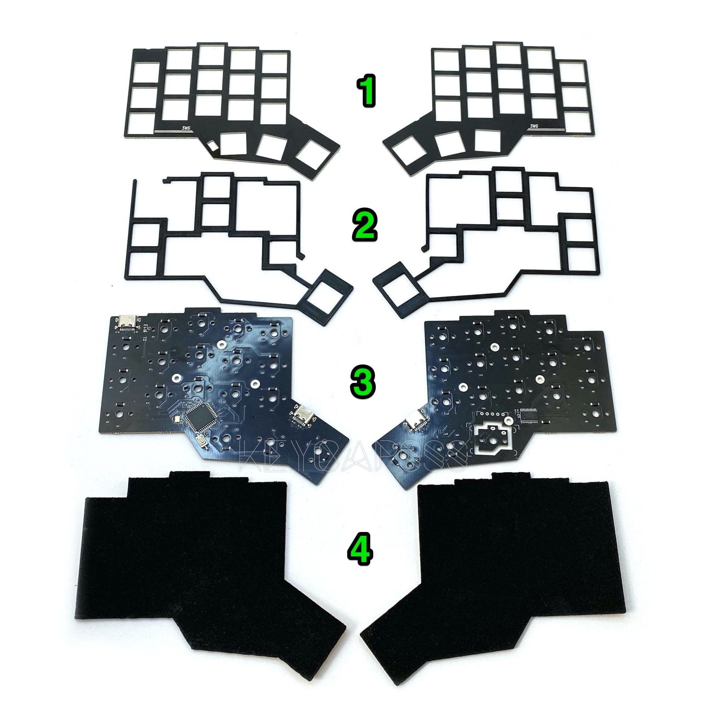
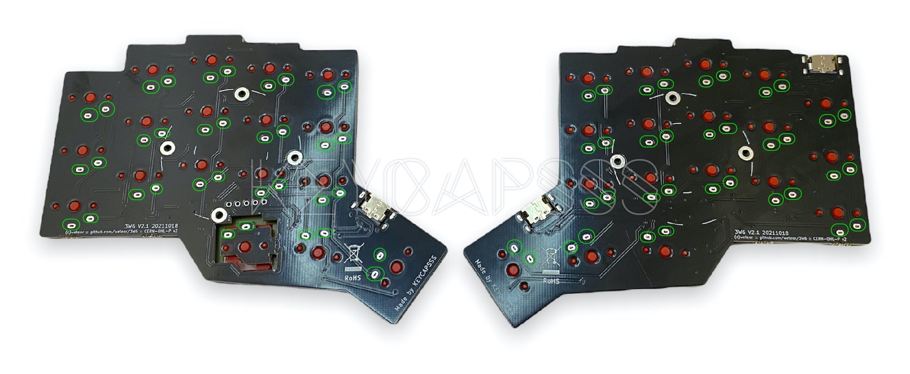
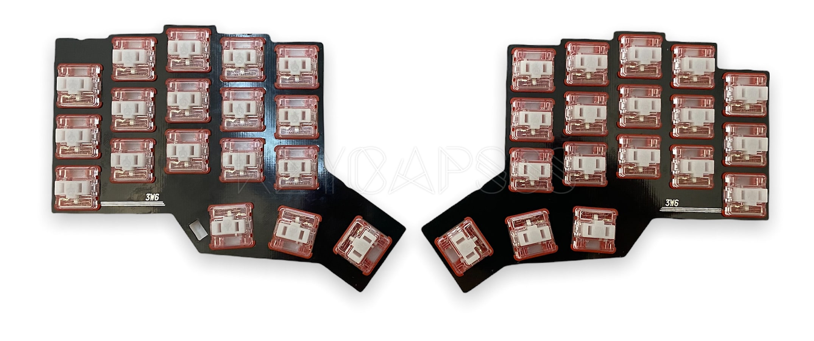
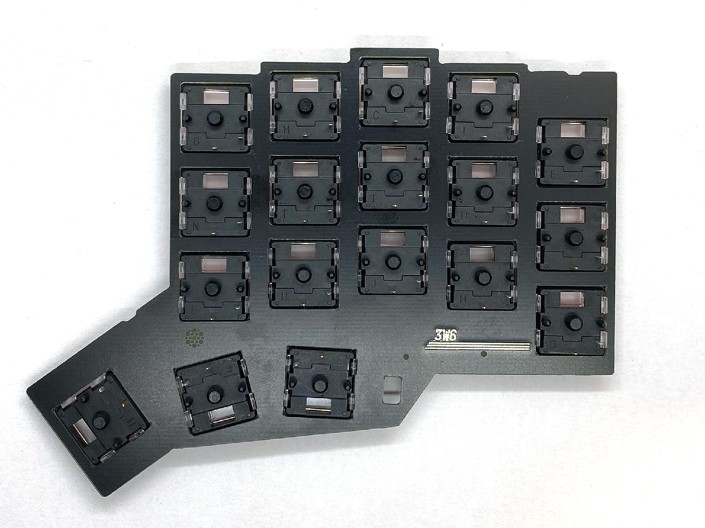
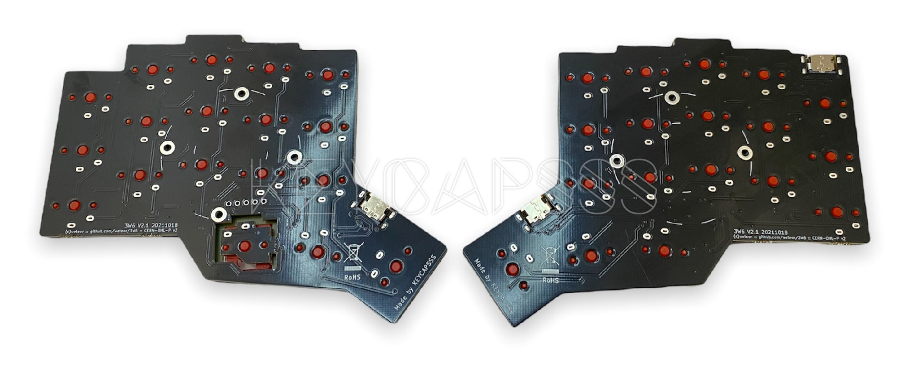
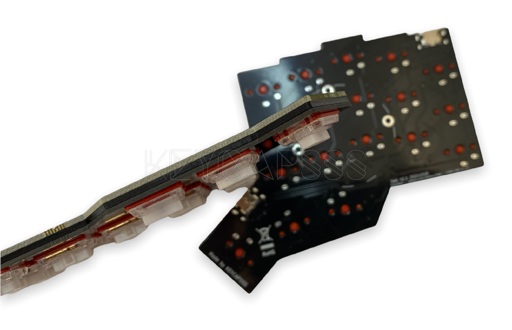
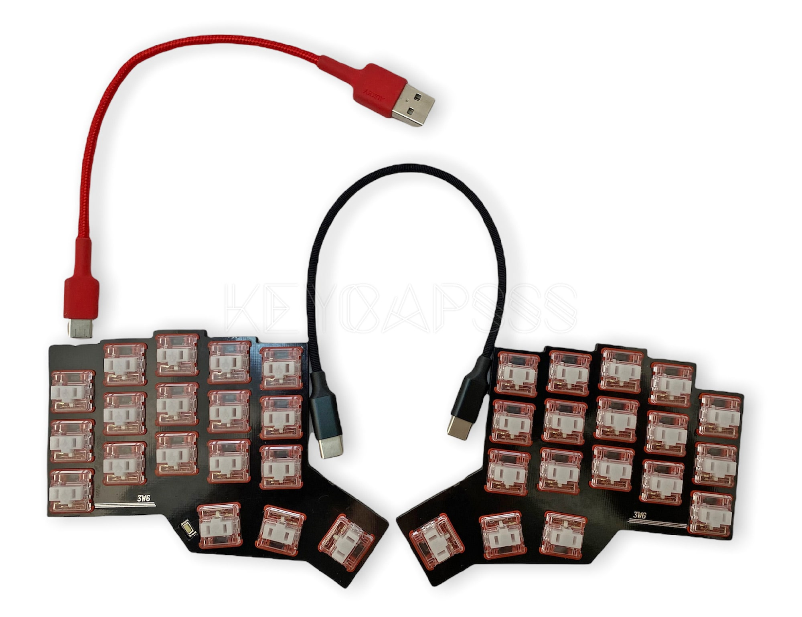
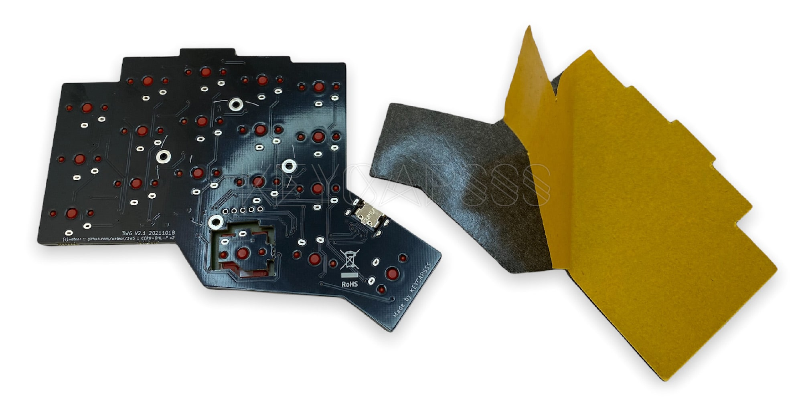
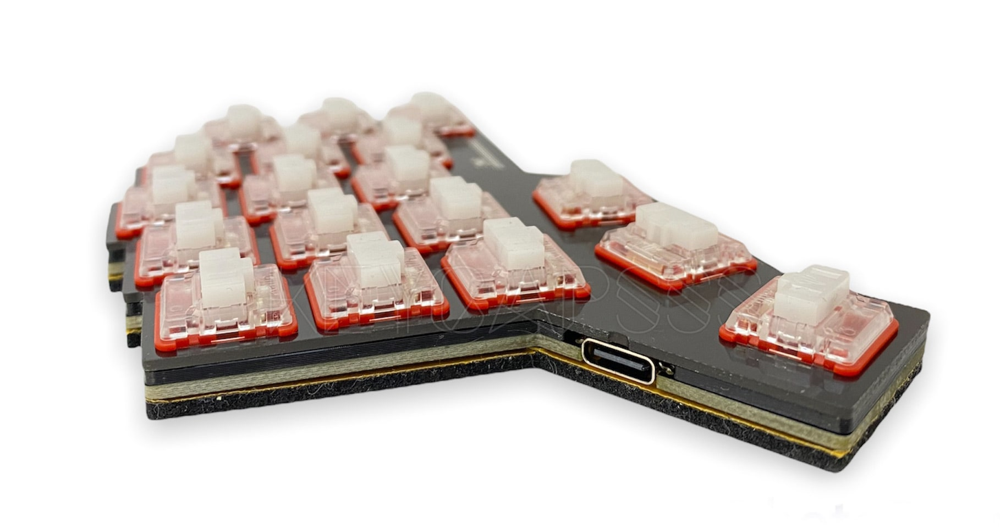

# 3w6 Build Guide

[](https://github.com/firstcontributions/first-contributions)
[](https://discord.gg/frjFXZB "Redirect to Keycapsss Discord")
[](https://creativecommons.org/licenses/by-nc-sa/4.0/)

## BOM

### Parts included in the kit

| Part name     | Qty | Remarks                                  |
| :------------ | :-- | :--------------------------------------- |
| Top plates    | 2   | Nr. 1 on the image below                 |
| Spacer plates | 2   | Nr. 2 on the image below, 3D printed PLA |
| PCB's         | 2   | Nr. 3 on the image below                 |
| Foam          | 2   | Nr. 4 on the image below, self-adhesive  |



### Additionally required parts

| Part name                      | Qty | Remarks                                    |
| ------------------------------ | --- | ------------------------------------------ |
| Choc V1 switches               | 36  | Choc V2 switches are __not__ supported     |
| 1U Choc keycaps (Lo Profile)   | 24  | MX keycaps are __not__ supported           |
| 1.5U Choc keycaps (Lo Profile) | 2   | MX keycaps are __not__ supported           |
| USB-C cable                    | 1   | To connect the keyboard to your computer   |
| USB-C to USB-C cable           | 1   | To connect both halfs, 20cm lenght is good |

### Optional parts

| Part name                 | Qty | Remarks                   |
| ------------------------- | --- | ------------------------- |
| Pimoroni Trackball module | 1   | support on the right half |

## Initial test

All PCB's are tested and the QMK firmware with the default keymap is already flashed on the master side.

I recommend to test each switch position for functionality.

Connect both half's with a USB-C to USB-C cable and connect the master side (left) with a USB-C cable to your computer.

Open [QMK Configurator page](https://config.qmk.fm/#/test) and bridge each switch solder point pair with a tweezers. It should trigger a key press. If not please contact me.




## Assembly

Attach the Choc V1 switches (36x) to the top plates and pay attention to the switch orientation. The lower row has a different orientation.



Check carefully if all switch pins are staight.



Put the 3D printed spacer on top of the PCB's.  
The SMD components must face up. Pay attention that left and right spacer are different.


Put the assembled top plates with the switches on the PCB's with the spacer.  
Do not press to hard. Turn the PCB's and check from the bottom view, if all switch pins are align with the holes in the PCB.



If all switch pins are aligned, press the top plate and the PCB together.  
If you have problems to close the gap, probably a switch pin is bent.



While you press the PCB down, solder all switch pin's (green marked)


Connect both half's with a USB-C to USB-C cable and connect the master side (left) with a USB-C cable to your computer.

Open [QMK Configurator page](https://config.qmk.fm/#/test) and test if all switches trigger a key press. If not check the corresponding solder point for the switch.



If everything works as expected, you can attach the self-adhesive foam to the underside.



The complete assembled 3W6 Split Keyboard should have 4 layers.
The self-adhesive protection foil was not removed for demonstration purpose.



## Firmware

The [QMK firmware](https://qmk.fm/) with the [default keymap]([https://link](https://github.com/qmk/qmk_firmware/blob/master/keyboards/3w6/keymaps/default/keymap.c)) is already flashed on board.

If you are not familiar with keymaps and the use of the QMK tool, please refer to the [QMK "Getting Started" guide](https://docs.qmk.fm/#/newbs).

With the command below, you compile the default keymap for the 3w6 (after setting up your build environment):

```bash
qmk compile -kb 3w6/rev2 -km default
```

To enter the bootloader mode, connect the board (master/left half) to the PC and push the reset button.

With the [QMK Tool Box](https://github.com/qmk/qmk_toolbox) you can flash the new compiled firmware (.hex file) to the board, after you entered the bootloader mode.

## Schematic

[](img/3w6-schematic.png)
