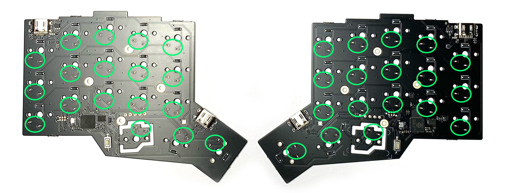
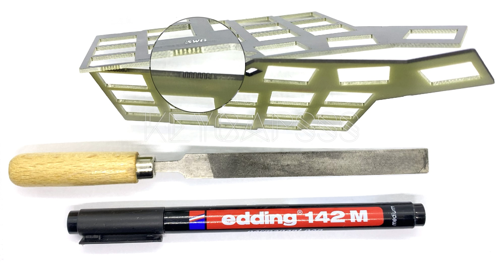

# 3w6-2040 Build Guide

[](https://github.com/firstcontributions/first-contributions)
[](https://discord.gg/frjFXZB "Redirect to Keycapsss Discord")
[](https://creativecommons.org/licenses/by-nc-sa/4.0/)

## BOM

### Parts included in the kit

| Part name     | Qty | Remarks                                  |
| :------------ | :-- | :--------------------------------------- |
| Top plates    | 2   | Nr. 1 on the image below                 |
| Spacer plates | 2   | Nr. 2 on the image below, 3D printed PLA |
| PCB's         | 2   | Nr. 3 on the image below                 |
| Foam          | 2   | Nr. 4 on the image below, self-adhesive  |


### Additionally required parts

| Part name                      | Qty | Remarks                                    |
| ------------------------------ | --- | ------------------------------------------ |
| Choc V1 switches               | 36  | Choc V2 switches are __not__ supported     |
| 1U Choc keycaps (Lo Profile)   | 24  | MX keycaps are __not__ supported           |
| 1.5U Choc keycaps (Lo Profile) | 2   | MX keycaps are __not__ supported           |
| USB-C cable                    | 1   | To connect the keyboard to your computer   |
| USB-C to USB-C cable           | 1   | To connect both halfs, 20cm lenght is good |

### Optional parts

| Part name                 | Qty | Remarks                   |
| ------------------------- | --- | ------------------------- |
| Pimoroni Trackball module | 1   | Support on both half's simultaneously, or only one side  |

## Initial test

All PCB's are tested and the VIAL QMK firmware is already flashed on both sides.

I recommend to test each switch position for functionality, before you solder the switches.

Connect both half's with a USB-C to USB-C cable and connect one side with a USB-C cable to your computer.

> The pre flashed firmware use ["Handedness by EEPROM"](https://docs.qmk.fm/#/feature_split_keyboard?id=handedness-by-eeprom), so it does not matter which half is master (connected to the computer).  
> The layout can be mirrored if "Handedness by EEPROM" is not used.

Open [QMK Configurator page](https://config.qmk.fm/#/test) and bridge each switch solder point pair with a tweezers. It should trigger a key press. If not please contact me.




## Visual enhancement (optional)

This step is not necessary, but will improve visually appealing of your 3W6 split keyboard.

Due to the manufacturing process of the PCB's, there are some rough edges. Use a small file to remove these marks (mouse bites).

You could also paint the edges black with a black Sharpie/Edding.



## Assembly

Attach the Choc V1 switches (36x) to the top plates and pay attention to the switch orientation. The lower row has a different orientation.

Check carefully if all switch pins are staight.


Put the 3D printed spacer on the back of the top plate.  


Place the pcb (SMD components must face down) on the top plate with the switches spacer.  
Do not press to hard. Check if all switch pins are align with the holes in the PCB.


If all switch pins are aligned, press the top plate and the PCB together.  
If you have problems to close the gap, probably a switch pin is bent.


While you press the PCB down, solder all switch pin's (green marked)


Connect both half's with a USB-C to USB-C cable and connect one half with a USB-C cable to your computer.

Open [QMK Configurator page](https://config.qmk.fm/#/test) and test if all switches trigger a key press. If not check the corresponding solder point for the switch.

If everything works as expected, you can attach the self-adhesive foam to the underside.

The complete assembled 3W6 Split Keyboard should have 4 layers  
*The self-adhesive protection foil was not removed for demonstration purpose.*


## Firmware

The [VIAL QMK firmware](https://get.vial.today) with the [vial keymap](https://github.com/vial-kb/vial-qmk/tree/vial/keyboards/keycapsss/3w6_2040/keymaps/vial) is already flashed on both half's.

To customize the layout of your 3W6, [download](https://get.vial.today/download/) the VIAL GUI, or use the [web version](https://vial.rocks/).
The keyboard should be detected right out of the box.

### Customize the firmware (optional)

With the command below, you compile the vial keymap for the 3w6 [(after setting up your build environment)](https://docs.qmk.fm/#/newbs):

```bash
make keycapsss/3w6_2040:vial:uf2-split-right
```

You will find a `keycapsss_3w6_2040_vial.uf2` in the qmk folder. Rename it to `keycapsss_3w6_2040_vial_right.uf2` and do the same for the left firmware file (replace `right` with `left`).

### Bootloader (flash firmware)

1. Push and hold the BOOTSEL button and connect the half to the computer.
2. A mass storage drive (RPI-RP2) should appear. You can release the BOOTSEL button.
3. Drag and drop the UF2 file onto the RPI-RP2 volume. The 3W6 will reboot.

## Schematic

[](https://github.com/Keycapsss/3w6/raw/master/img/3w6-rp2040-schematic-1.png)
*Schematic for the RP2040 part (right side is equal)*
