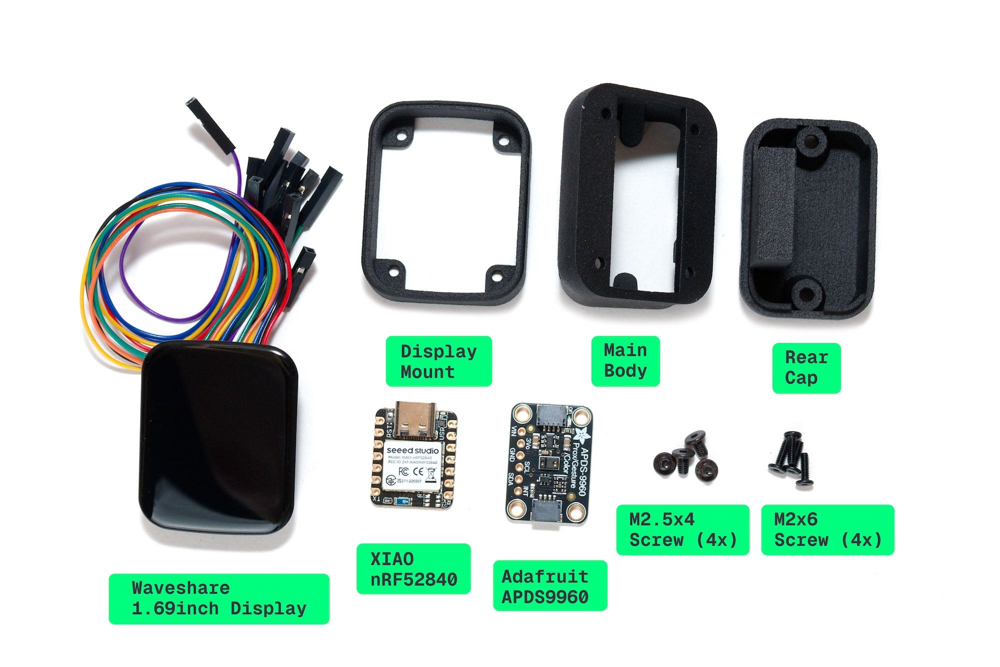
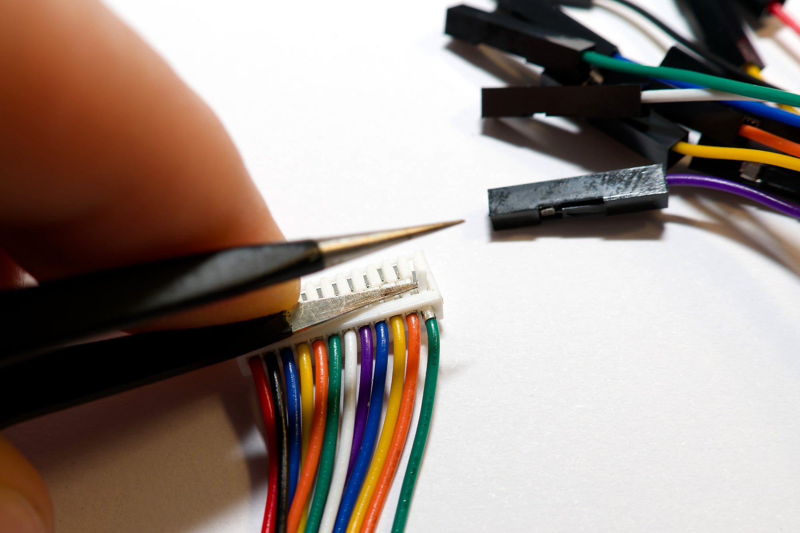
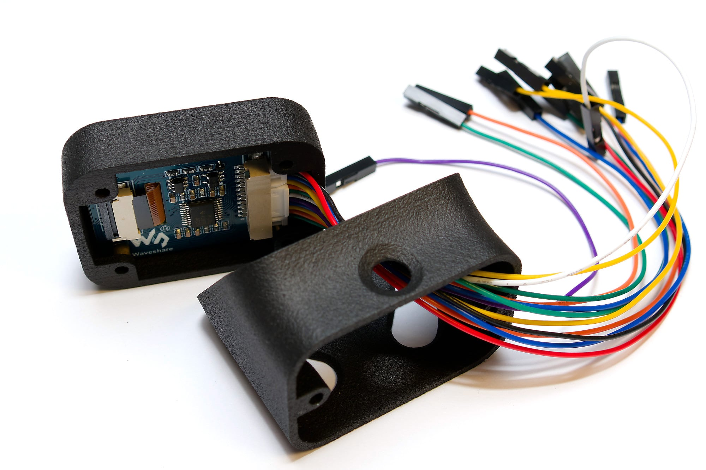
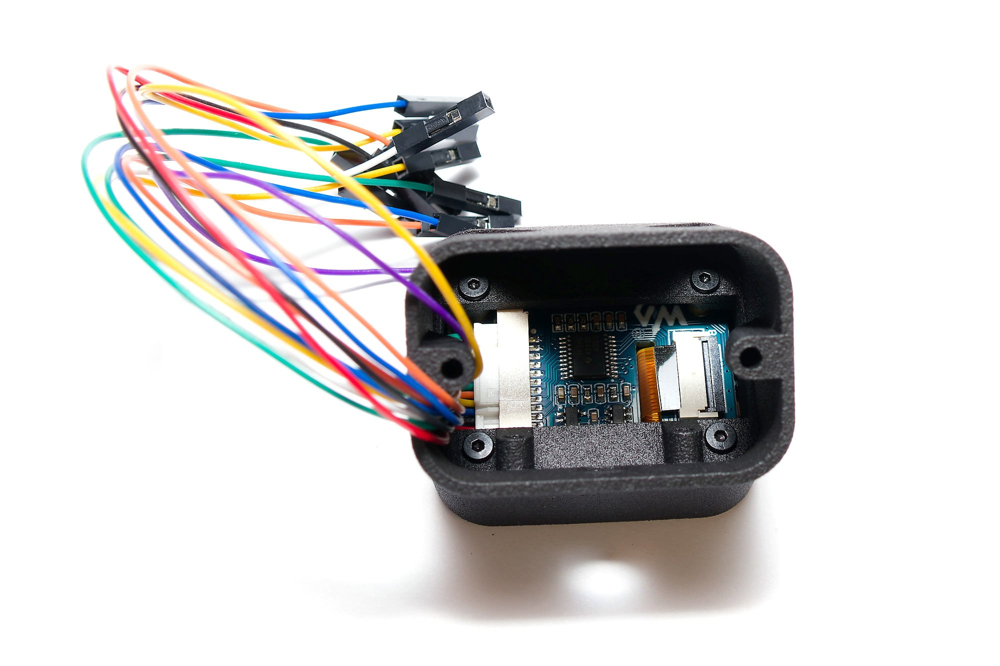
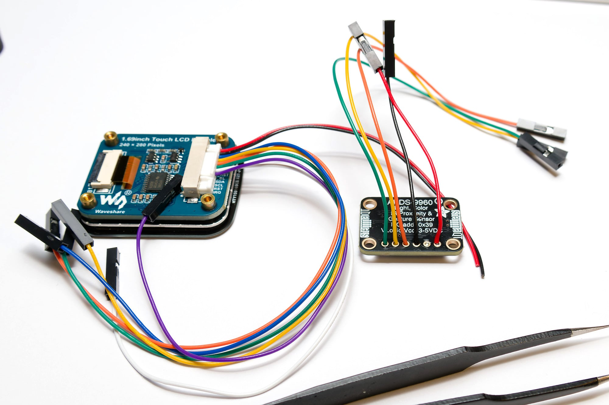
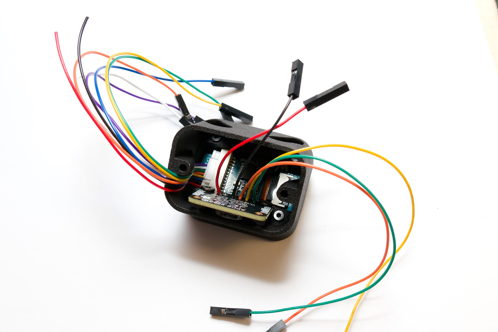
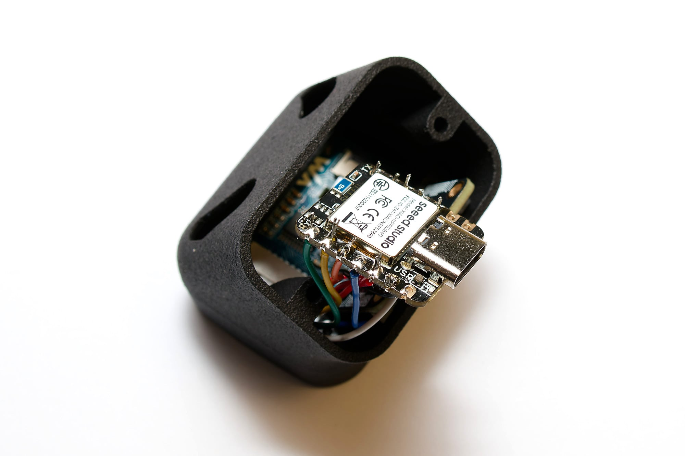
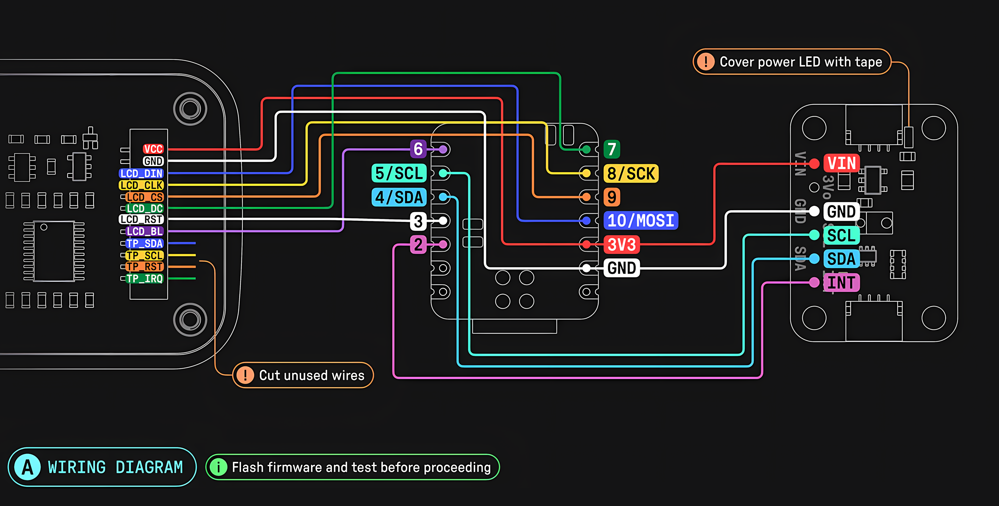
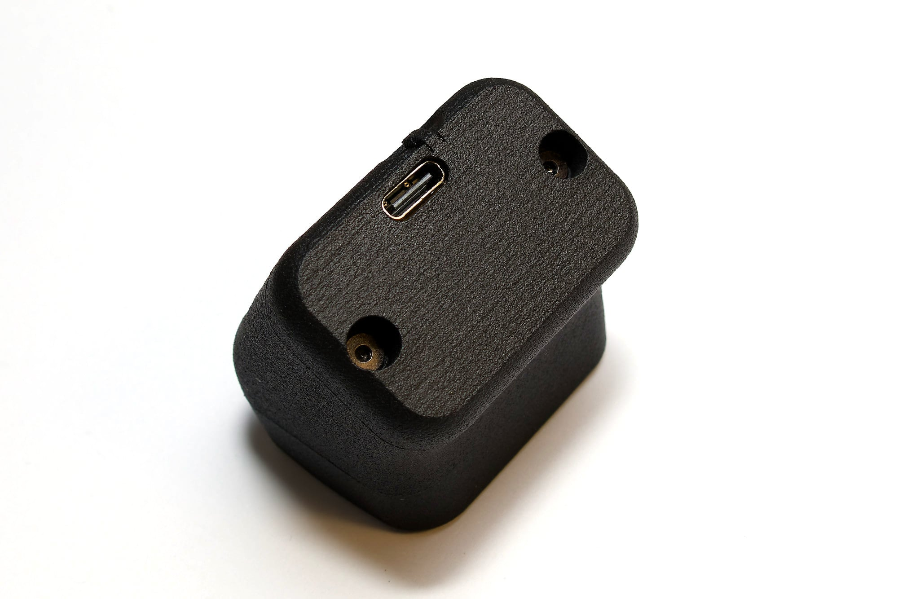

## Parts included in the Kit

| Part Name                                                            | Count |
| -------------------------------------------------------------------- | ----- |
| 3D-printed case (display mount, main body, rear cap, light guid cap) | 1     |
| Seeed Studio XIAO nRF52840                                           | 1     |
| Waveshare 1.69inch Round LCD Display Module with Touch               | 1     |
| Adafruit APDS9960 Proximity, Light, RGB, and Gesture Sensor          | 1     |
| M2x6 pan/wafer head screws                                           | 4     |
| M2.5x4 pan/wafer head screws                                         | 4     |

## Other required items

- Soldering iron with adjustable temperature (320°C)
- Solder (i use Sn99.3Cu0.7 0.5mm/0.02inch)
- Flux
- Tip cleaner (wet sponge or brass wool)
- Side cutters/flush cutters

## Prepare the Display cable

You need some extra wires for the light sensor and the last 4 wires on the display cable are not connected later. So remove these and keep them for later.
Use the tweezers to lift the platic and pull out the wire (only the green, orange, yellow and blue wire).

## Mount the display

Connect the display cable.

Attach the display to the display mount. Use 4x M2x6 screws to mount it to the main body.

Keep attention to the orientation of the display and it's cable.

## Solder wires

Solder the wires to the light sensor like on the picture.
Use 3 from the previouse saved wires and cut a piece of red and black wire from the display cable approximately 5 cm long.

Turn the main body up side down and put the transparent light guide in the hole of the main body.

Place the light sensor in the main body (SMD parts facing to the light guide) and secure it with 2x M2.5x4 screws.

::: warning
Do not overtighten the screws, or the plastic threads will break!
:::

Solder all wire to the XIAO. Below you find the wiring diagram.
::: warning
Please pay attention that the three colored cable from the light sensor board have different colors in the wiring diagram.

Also the blue and purple wires are easy to confuse.
:::

_Source: [Prospector docs by carrefinho](https://github.com/carrefinho/prospector/blob/main/docs/prospector_assembly_manual.jpg)_

Cut off the protruding pins with side cutters.

## Complet the case

Use the remaining 2x M2.5x4 screws to secure the rear cap to the main body.

::: warning
Do not overtighten the screws, or the plastic threads will break!
:::

## Install Firmware

Plug in the USB-C to the Prospector. A green led light should be visible at the top and the display blinks black.

Double press the reset switch at the bottom of the Prospector case. A storage should appear in you file browser.

Drag the `forager_dongle_prospector.uf2` firmware file on it and wait until the storage is automatic ejected.

The Prospector should display the standard screen as below.

   - [ ] image from screen

First factory resest if allready paired with a computer.

