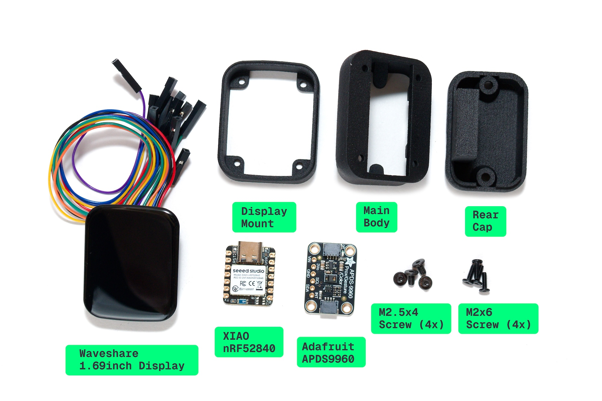
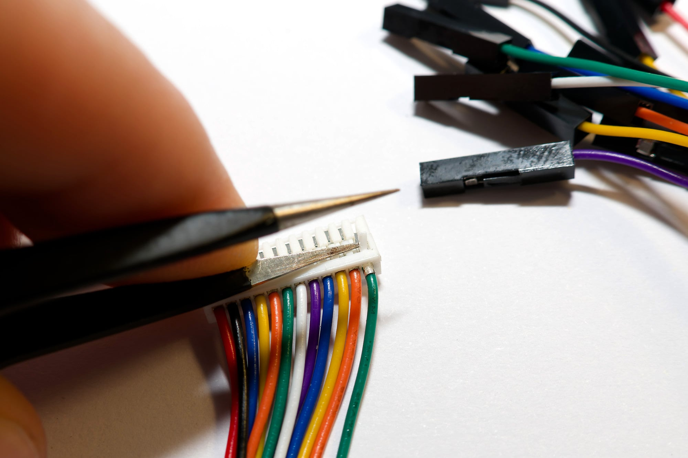
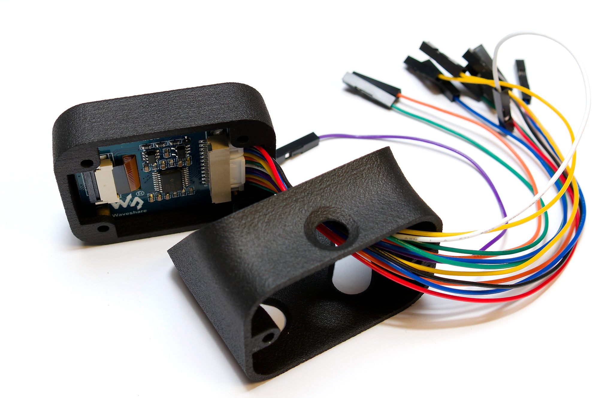
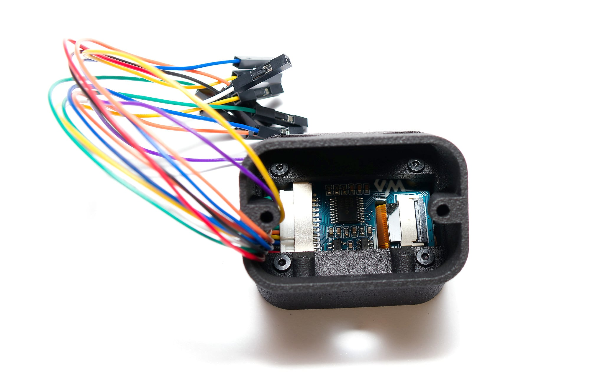
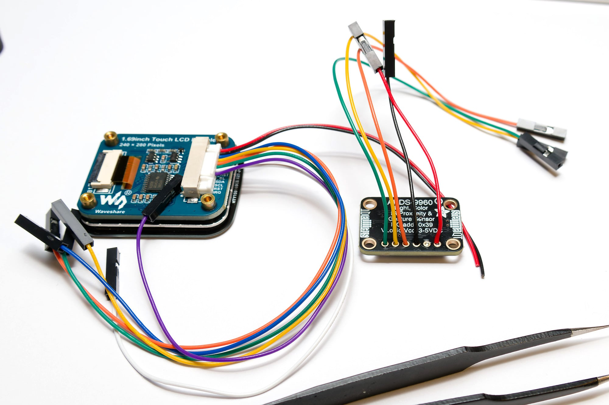
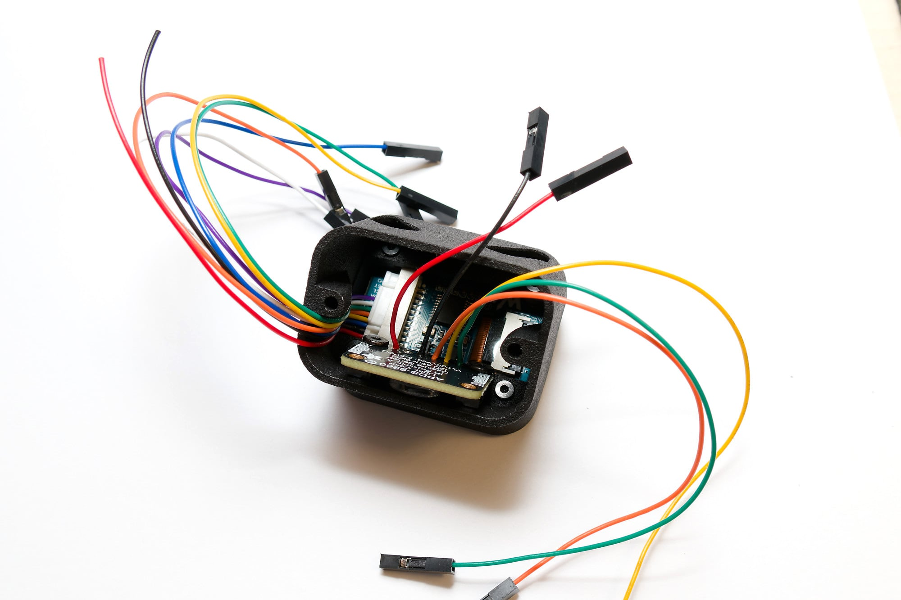
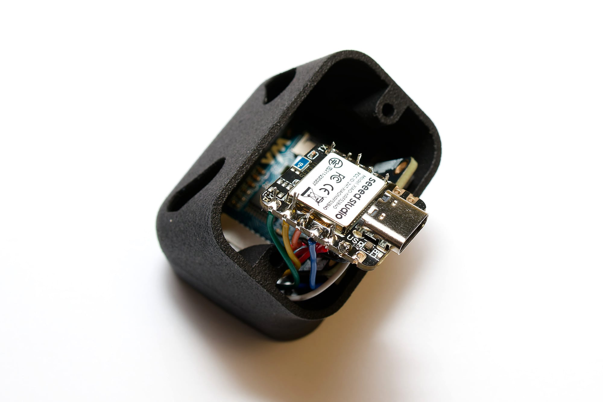
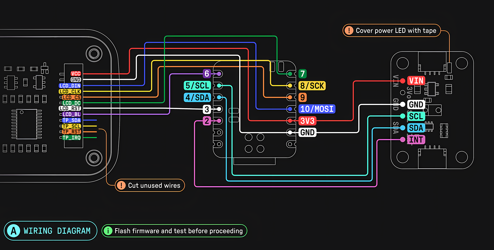
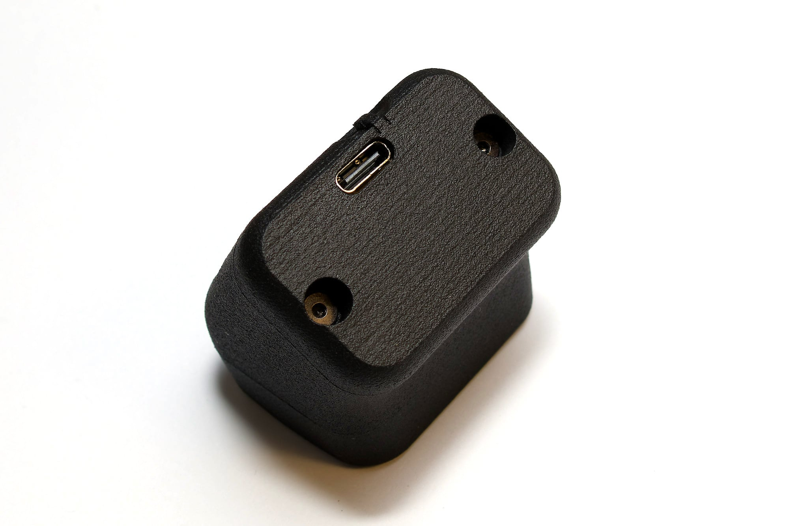

# Prospector ZMK Dongle - Build Guide

> [!NOTE]
> This build guide is in progress.
> Missing parts:
>
> - Images of the transparent light guide
> - Image of Xiao mounted in to the rear cap
> - Customize the firmware

> [!IMPORTANT]
> Do not press the reset button on the rear cap unless an XIAO is installed (doing so will break it).

## Parts included in the Kit



| Part Name                                                            | Count |
| -------------------------------------------------------------------- | ----- |
| 3D-printed case (display mount, main body, rear cap, light guid cap) | 1     |
| Seeed Studio XIAO nRF52840                                           | 1     |
| Waveshare 1.69inch Round LCD Display Module with Touch               | 1     |
| Adafruit APDS9960 Proximity, Light, RGB, and Gesture Sensor          | 1     |
| M2x6 pan/wafer head screws                                           | 4     |
| M2.5x4 pan/wafer head screws                                         | 4     |

### Other required items

- 1/16 hexagon screwdriver (1.5 metric will not work properly) for M2.5 screws
- 0.05" or 1.3mm hexagon screwdriver for M2 screws
- Soldering iron with adjustable temperature (320°C)
- Solder (i use Sn99.3Cu0.7 0.5mm/0.02inch)
- Flux
- Tip cleaner (wet sponge or brass wool)
- Side cutters/flush cutters

## Assembly

A build guide by Carrefinho is available [here]([https://](https://raw.githubusercontent.com/carrefinho/prospector/main/docs/prospector_assembly_manual.jpg)).

### Prepare the Display cable

You need some extra wires for the light sensor and the last 4 wires on the display cable are not connected later. So remove these and keep them for later.
Use the tweezers to lift the platic and pull out the wire (only the green, orange, yellow and blue wire).



### Mount the display

Connect the display cable.



Attach the display to the display mount. Use 4x M2x6 screws to mount it to the main body.

Keep attention to the orientation of the display and it's cable.



### Solder wires

Solder the wires to the light sensor like on the picture.
Use 3 from the previouse saved wires and cut a piece of red and black wire from the display cable approximately 5 cm long.

Cover the green power LED on the light sensor PCB with tape to prevent it from affecting the light sensor. Refer to the [wiring diagram](#wiring-diagram) to identify the correct position.



Turn the main body up side down and put the transparent light guide in the hole of the main body.

Place the light sensor in the main body (SMD parts facing to the light guide) and secure it with 2x M2.5x4 screws.

::: warning
Do not overtighten the screws, or the plastic threads will break!
:::





Solder all wire to the XIAO. Below you find the wiring diagram.
::: warning
Please pay attention that the three colored cable from the light sensor board have different colors in the wiring diagram.

Also the blue and purple wires are easy to confuse.
:::

#### Wiring diagram


_Source: [Prospector docs by carrefinho](https://github.com/carrefinho/prospector/blob/main/docs/prospector_assembly_manual.jpg)_

Cut off the protruding pins with side cutters.

### Complet the case

Use the remaining 2x M2.5x4 screws to secure the rear cap to the main body.

::: warning
Do not overtighten the screws, or the plastic threads will break!
:::



## Firmware

### Install firmware

Plug in the USB-C to the Prospector. A green led light should be visible at the top and the display blinks black.

Double press the reset switch at the bottom of the Prospector case. A storage should appear in you file browser.

Drag the `forager_dongle_prospector.uf2` firmware file on it and wait until the storage is automatic ejected.

The Prospector should display the standard screen as below.

   - [ ] image from screen


First factory resest if allready paired with a computer.

### Customize the firmware
> [!WARNING]
> Before flashing your new firmware, you need to flash settings_reset firmware on all devices to ensure they can pair to each other.

> [!NOTE]
> Adding the option to use a dongle is super simple. [You can see a complete example here](https://github.com/mctechnology17/zmk-config).

To add that option to any keyboard we will modify a couple of files following the structure of the [official zmk documentation](https://zmk.dev/docs/development/hardware-integration/dongle#dongle-folder).
In this example we use the traditional corne and we add our new shield, be careful the shield has to have a unique name and does not have to exist in zmk (the `corne_dongle` name is also valid)

```kconfig
# file: Kconfig.shield

config SHIELD_CORNE_LEFT
    def_bool $(shields_list_contains,corne_left)

config SHIELD_CORNE_RIGHT
    def_bool $(shields_list_contains,corne_right)

config SHIELD_CORNE_DONGLE_XIAO
    def_bool $(shields_list_contains,corne_dongle_xiao)
```

[Here you can see the complete example](https://github.com/mctechnology17/zmk-config/blob/c8bfb271a06bfc6b8a5e9ade51a67203cf1e2c1e/boards/shields/corne/Kconfig.shield#L16). Note carefully that the name of the shield is defined twice in capital letters with the prefix `shield` and again without that prefix separated by a comma!

Now we have to indicate in our `Kconfig.defconfig` file that our `central` side has changed ([see full example hier](https://github.com/mctechnology17/zmk-config/blob/main/boards/shields/corne/Kconfig.defconfig)):

```kconfig
# file: Kconfig.defconfig
if SHIELD_CORNE_DONGLE_XIAO

config ZMK_KEYBOARD_NAME
    default "Corne"

config ZMK_SPLIT_ROLE_CENTRAL
    default y

endif
```

Here we simply indicate all the properties that they share in common in our `Kconfig.defconfig`, for example the definition of an OLED screen if that is the case that we want to share ([In this case we don't do it, but here it is done](https://github.com/mctechnology17/zmk-config/blob/c8bfb271a06bfc6b8a5e9ade51a67203cf1e2c1e/boards/shields/corne/Kconfig.defconfig#L23-L56)). As a tip, remember that default options are added here and these options can be enabled or disabled from the `.conf` files.

As tip number 2, we do not define an `oled` screen like in the traditional corne here in case we want to use an external screen like the `prospector` in our dongle!

```kconfig
# file: Kconfig.defconfig
if SHIELD_CORNE_LEFT || SHIELD_CORNE_RIGHT || SHIELD_CORNE_DONGLE_XIAO

config ZMK_SPLIT
    default y

config ZMK_BLE
	default y

endif
```

It's time to add our file `corne_dongle_xiao.overlay`. [This file will include your keyboard's matrix transform and physical layout, allowing it to map key press events from the peripherals to behaviors.](https://zmk.dev/docs/development/hardware-integration/dongle#dongle-overlay-file).

```dtsi
// file: corne_dongle_xiao.overlay

#include <dt-bindings/zmk/matrix_transform.h>

#include <layouts/foostan/corne/5column.dtsi>
#include <layouts/foostan/corne/6column.dtsi>

&foostan_corne_6col_layout {
    transform = <&default_transform>;
};

&foostan_corne_5col_layout {
    transform = <&five_column_transform>;
};

/ {
    chosen {
        zmk,kscan = &mock_kscan;
        zmk,physical-layout = &foostan_corne_6col_layout;
    };

    default_transform: keymap_transform_0 {
        compatible = "zmk,matrix-transform";
        columns = <12>;
        rows = <4>;
// | SW1  | SW2  | SW3  | SW4  | SW5  | SW6  |   | SW6  | SW5  | SW4  | SW3  | SW2  | SW1  |
// | SW7  | SW8  | SW9  | SW10 | SW11 | SW12 |   | SW12 | SW11 | SW10 | SW9  | SW8  | SW7  |
// | SW13 | SW14 | SW15 | SW16 | SW17 | SW18 |   | SW18 | SW17 | SW16 | SW15 | SW14 | SW13 |
//                      | SW19 | SW20 | SW21 |   | SW21 | SW20 | SW19 |
        map = <
RC(0,0) RC(0,1) RC(0,2) RC(0,3) RC(0,4) RC(0,5)  RC(0,6) RC(0,7) RC(0,8) RC(0,9) RC(0,10) RC(0,11)
RC(1,0) RC(1,1) RC(1,2) RC(1,3) RC(1,4) RC(1,5)  RC(1,6) RC(1,7) RC(1,8) RC(1,9) RC(1,10) RC(1,11)
RC(2,0) RC(2,1) RC(2,2) RC(2,3) RC(2,4) RC(2,5)  RC(2,6) RC(2,7) RC(2,8) RC(2,9) RC(2,10) RC(2,11)
                        RC(3,3) RC(3,4) RC(3,5)  RC(3,6) RC(3,7) RC(3,8)
        >;
    };

    five_column_transform: keymap_transform_1 {
        compatible = "zmk,matrix-transform";
        columns = <10>;
        rows = <4>;
// | SW2  | SW3  | SW4  | SW5  | SW6  |   | SW6  | SW5  | SW4  | SW3  | SW2  |
// | SW8  | SW9  | SW10 | SW11 | SW12 |   | SW12 | SW11 | SW10 | SW9  | SW8  |
// | SW14 | SW15 | SW16 | SW17 | SW18 |   | SW18 | SW17 | SW16 | SW15 | SW14 |
//               | SW19 | SW20 | SW21 |   | SW21 | SW20 | SW19 |
        map = <
RC(0,1) RC(0,2) RC(0,3) RC(0,4) RC(0,5)  RC(0,6) RC(0,7) RC(0,8) RC(0,9) RC(0,10)
RC(1,1) RC(1,2) RC(1,3) RC(1,4) RC(1,5)  RC(1,6) RC(1,7) RC(1,8) RC(1,9) RC(1,10)
RC(2,1) RC(2,2) RC(2,3) RC(2,4) RC(2,5)  RC(2,6) RC(2,7) RC(2,8) RC(2,9) RC(2,10)
                        RC(3,3) RC(3,4) RC(3,5)  RC(3,6) RC(3,7) RC(3,8)
        >;
    };

    mock_kscan: kscan_0 {
        compatible = "zmk,kscan-mock";
        // wakeup-source;
        columns = <0>;
        rows = <0>;
        events = <0>;
    };
};
```
[If your keyboard is totally DIY and does not exist in the zmk list, you can create a physical layout this way](https://zmk.dev/docs/development/hardware-integration/physical-layouts)

Now we make our last modification to our `corne_dongle_xiao.conf` file. The first two configurations are optional, but very good to use, these help you increase the ble signal and also prevent the dongle from going into sleep mode.

```conf
# file: corne_dongle_xiao.conf
CONFIG_BT_CTLR_TX_PWR_PLUS_8=y
CONFIG_ZMK_SLEEP=n

### DONGLE MODE / THIS OPTION ACTIVATES THE DONGLE
CONFIG_ZMK_SPLIT_BLE_CENTRAL_PERIPHERALS=2
```

As a refresher, we only need to create 4 files (path or dir: `zmk-config/boards/shields/corne`):
- Kconfig.shield
- Kconfig.defconfig
- corne_dongle_xiao.conf
- corne_dongle_xiao.overlay

This is a vision of what the structure of your repository will look like in the end:

```bash
zmk-config
├── boards
│   └── shields
│       ├── corne
│       │   ├── corne_dongle_xiao.conf # new
│       │   ├── corne_dongle_xiao.overlay # new
│       │   ├── Kconfig.defconfig # new
│       │   └── Kconfig.shield # new
├── build.yaml # modify for prospector hier
└── config
    ├── corne.conf # here your usual configuration
    ├── corne.keymap # here your usual keymap
    └── west.yml # modify for prospector hier
```

Now we are going to compile, for that we need to modify our `west.yml` file:
```ymk
---
include:

  - board: puchi_ble_v1
    shield: corne_left
    artifact-name: puchi_corne_left

  - board: puchi_ble_v1
    shield: corne_right
    artifact-name: puchi_corne_right

  # xiao + prospector
  - board: seeeduino_xiao_ble
    shield: corne_dongle_xiao prospector_adapter
    artifact-name: xiao_dongle_prospector_adapter
    snippet: studio-rpc-usb-uart
```

Don't forget to add the reference to the [prospector module](https://github.com/carrefinho/prospector-zmk-module) for the compilation! Add this module to your config/west.yml with these new entries under remotes and projects:

```yml
manifest:
  remotes:
    - name: zmkfirmware
      url-base: https://github.com/zmkfirmware
    - name: carrefinho                            # <--- add this
      url-base: https://github.com/carrefinho     # <--- and this
  projects:
    - name: zmk
      remote: zmkfirmware
      revision: main
      import: app/west.yml
    - name: prospector-zmk-module                 # <--- and these
      remote: carrefinho                          # <---
      revision: main                              # <---
  self:
    path: config
```

Now just wait for the compilation and flash your DIY keyboard, enjoy!!
