# Reviung41 Build-Guide

 

[Japanese Build-Guide](https://reviung.com/build-guide/391/)

## Solder parts on bottom side

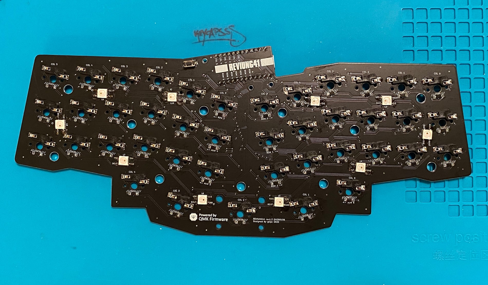

Solder the 41 hot-swap sockets, 41x SMD diodes and the 10x WS2812 led's to the bottom side.

Pay attention to orientation, SMD diodes and  WS2812 led's are polarized. If the orientation is incorrect, the key will not respond, or led will not light up.

Solder the diode as shown in the following figure.
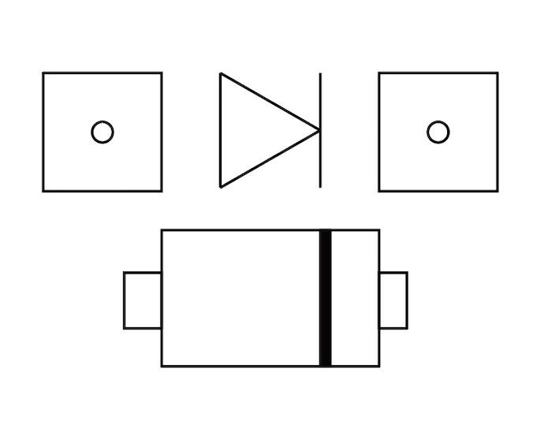

Solder the WS2812 led's as shown in the following figure.  
[Video: How to solder the WS2812 led's.](https://twitter.com/GTIPS_SH/status/1204244088867807234?s=20)

## Solder parts on top side

Solder 1x WS2812 led to the top side. Pay attention to orientation, WS2812 led's are polarized.  
Check the image below.

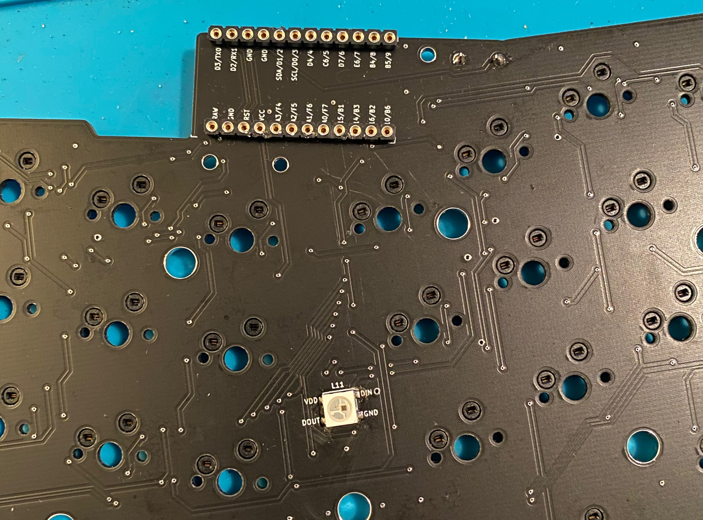

**I strongly recommend to use sockets for the Pro Micro.**  
If something went wrong, it's much easier to replace the Pro Micro.

[Mill-Max Single Row Socket Headers](https://keycapsss.com/keyboard-parts/parts/100/single-row-socket-headers-pins-mill-max-series-315) or [Spring-loaded pin headers](https://keycapsss.com/keyboard-parts/parts/91/spring-loaded-pin-headers-12-pin-2pcs-conthrough) will work.

## Attach the Pro Micro (with sockets)

**Before installing the Pro Micro, no matter which (can also happen on the Elite C, or Puchi-C), check whether they are working by plugging them in and [flashing the default keymap](#flash-qmk-firmware).**

Insert the pins (you can also use legs from through hole diodes/resistor) with a plier into the sockets.

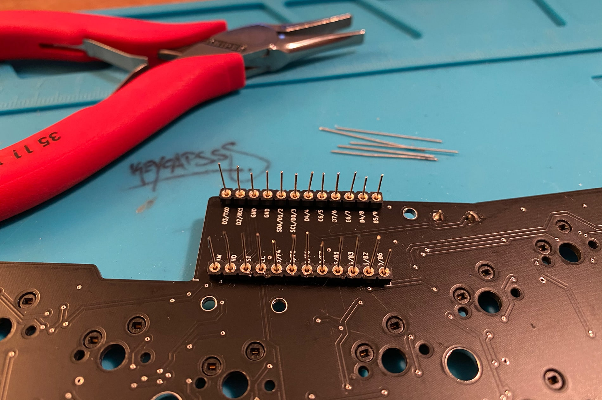

Place the Pro Micro (Micro-USB socket facing down).  
Solder the pins and shorten the pins with diagonal pliers.

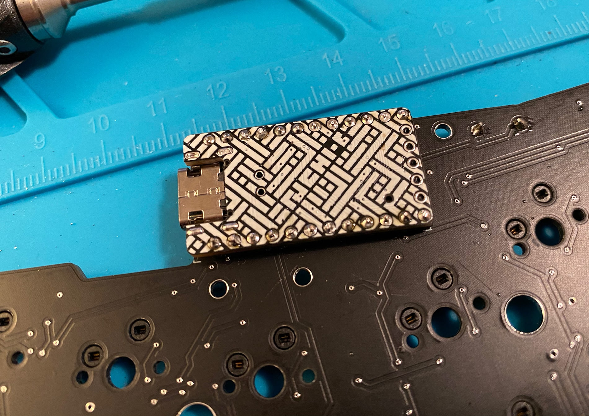

## Optional: Install the 2U stabilizer

The stabilizer is optional, but improves the feeling.

To improve the sound of the stabilizer, i recommend to attach a [foam sticker](https://keycapsss.com/keyboard-parts/parts/137/stabilizer-foam-sticker).

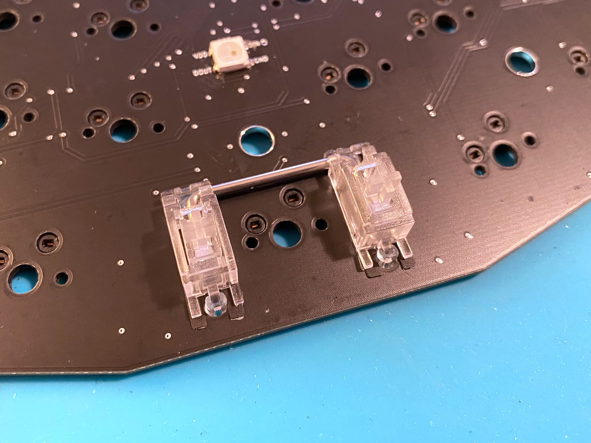

## Top plate assembly

Insert all switches of your choice (MX and clones) into the top plate.

Attach the 11x 8mm spacer to the top plate with the M2x5mm screws.

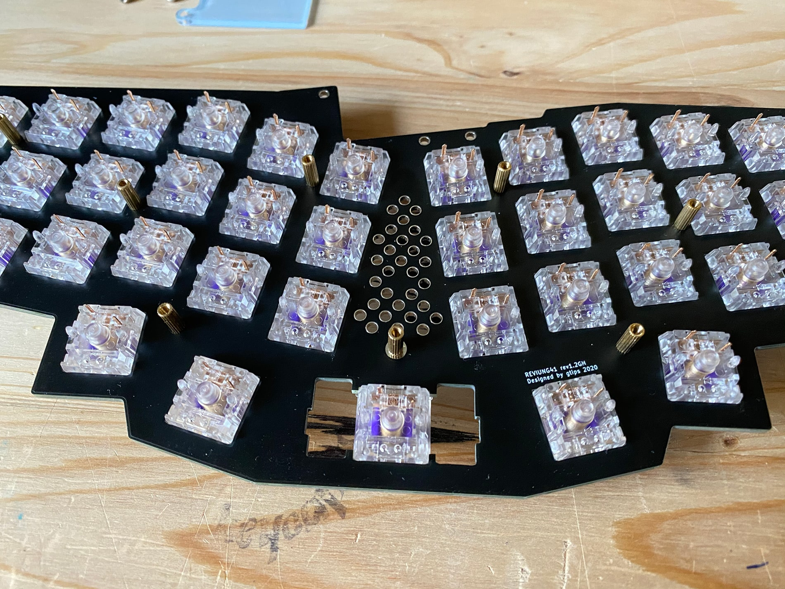

Put the top acrylic plate on mid pcb like on the image below.

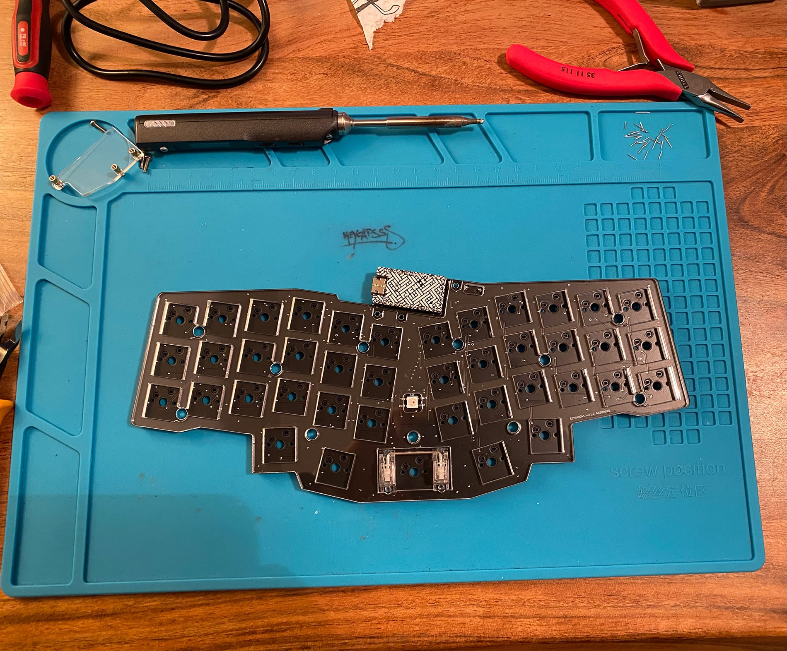

Check that all pins from the switches are straight and not bent. This is important that all pins move into the switch sockets in the next step.

Put the top plate with the switches on the two plates from the previous step.  
Confirming that there are no bends in the switch pins.

## Attach the protection cover

You need 3x M2x4mm screws, 3x4mm spacer and 3x M2x8mm screws and the 2mm acrylic cover.

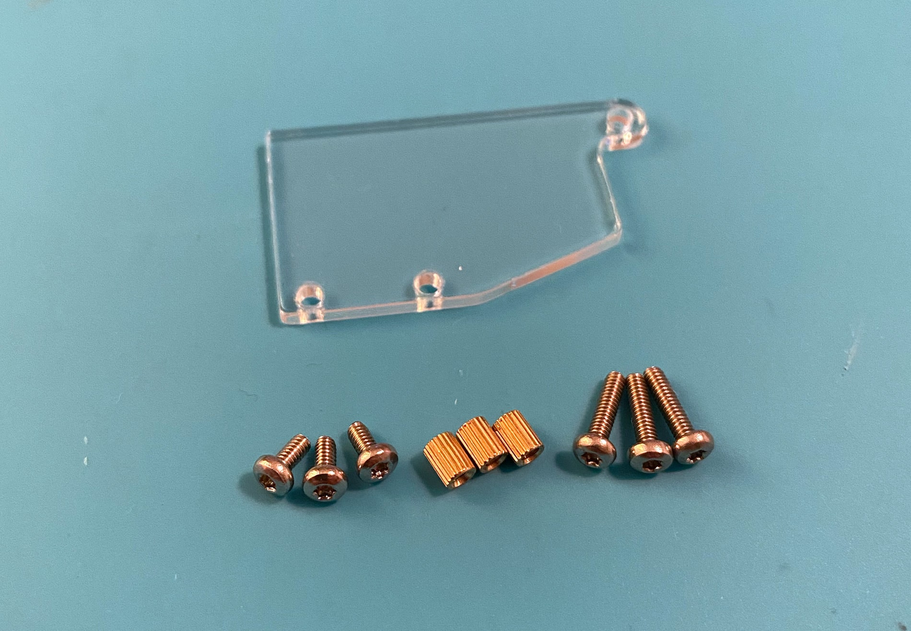

Fasten the spacer with the 4mm screws like on the image.

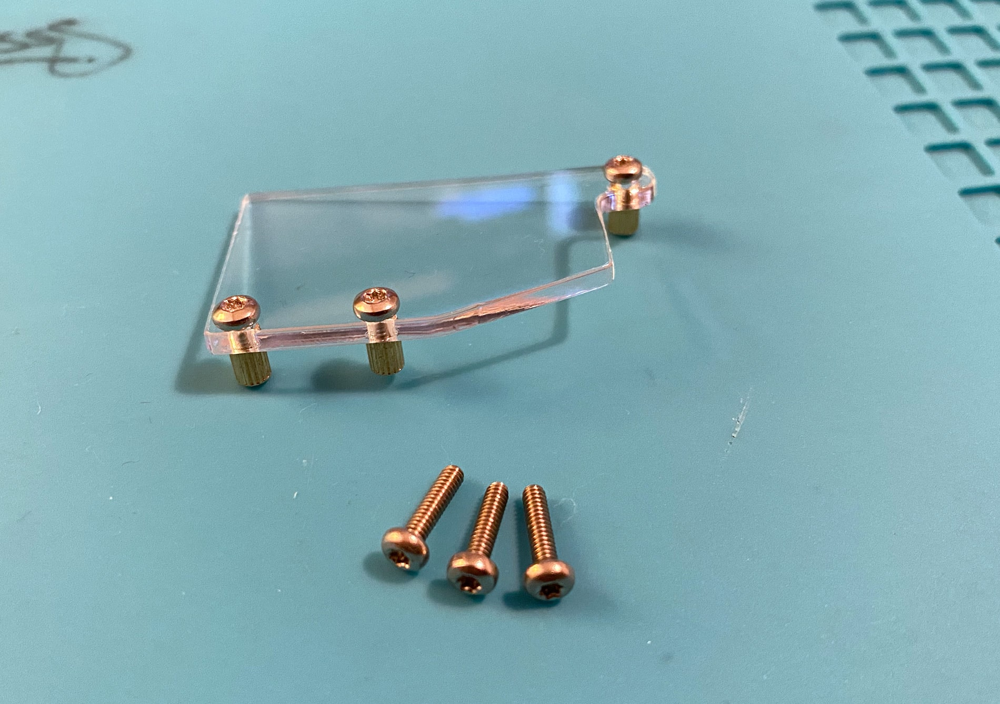

Place the protection cover on the top side of the pcb and fasten it with the 8mm screws from the bottom side.

## Bottom plate assembly

Put the inner bottom acrylic plate on mid pcb from the bottom.

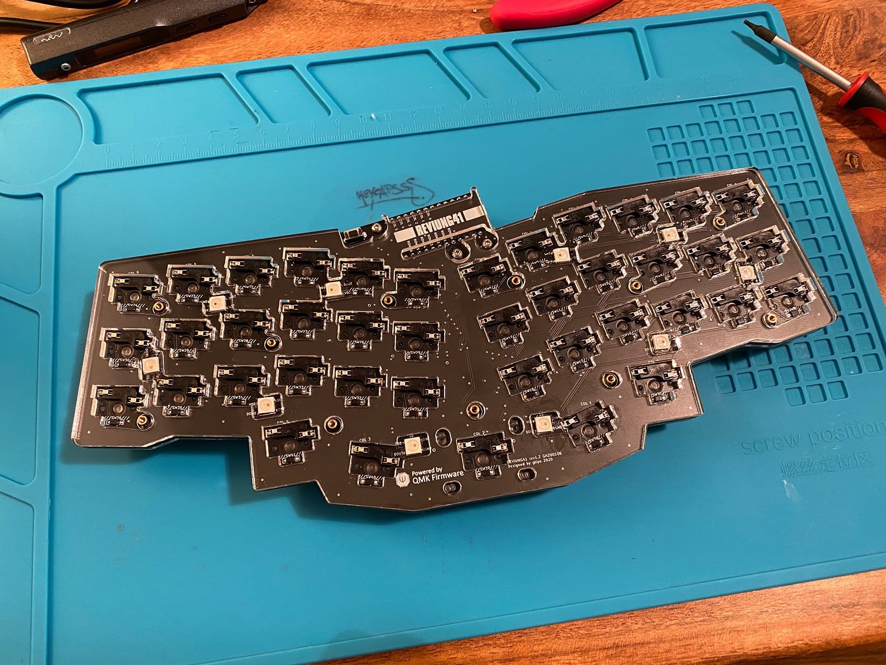

Put the bottom acrylic plate on the bottom and fasten it with 11x M2x5mm screws.

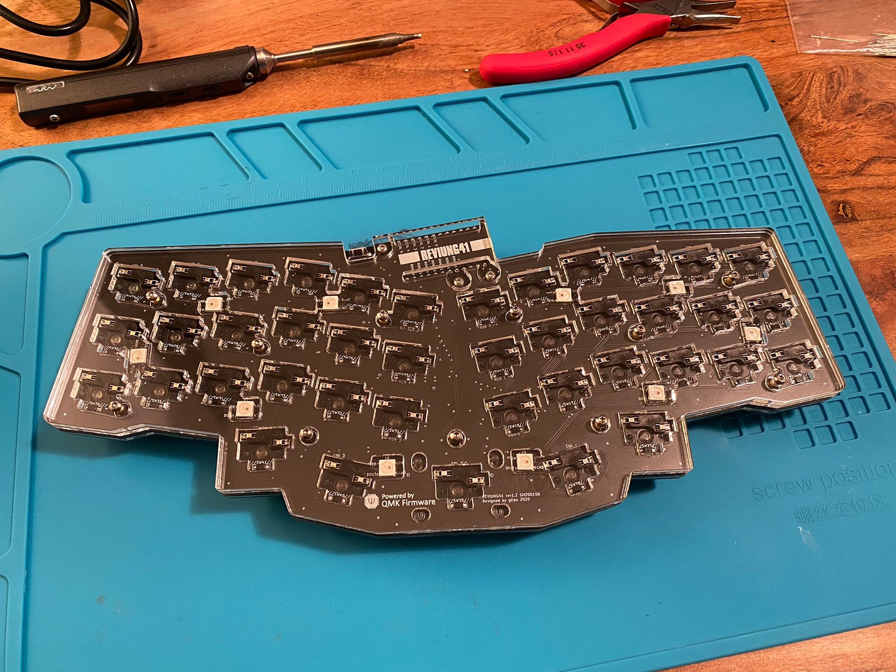

Attach the rubber feed to the bottom plate.

## Flash QMK firmware

The board requires a keymap in order to function. This section assumes that you're familiar with keymaps and the use of the QMK tool. If not, please refer to the QMK ["Getting Started" guide](https://docs.qmk.fm/#/getting_started_build_tools).

The [QMK Toolbox](https://github.com/qmk/qmk_toolbox/releases) can be used to write non-customized keymaps via a GUI, avoiding the need to configure a local QMK environment. (For custom keymaps, it's recommended to build the full environment described above).

Clone/download the QMK firmware and execute the following in the [qmk_firmware](https://github.com/qmk/qmk_firmware) directory to write the default Reviung41 keymap.

    make reviung41:default:flash
    
When `Detecting USB port, reset your controller now...` is displayed, press the reset button on the keyboard to start writing.

[Default Keymap File](https://github.com/qmk/qmk_firmware/blob/master/keyboards/reviung41/keymaps/default/keymap.c)